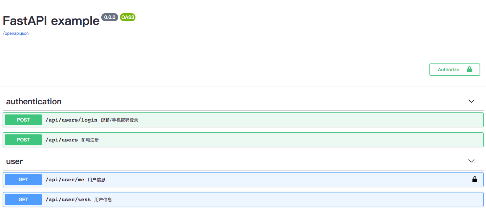

# fastapi-example
fastapi、mongo、jwt example

# install

```
pip install -r requirements.txt
```

# start
```
uvicorn --host=0.0.0.0 app.main:app
```

# api

- [x] jwt鉴权
- [x] 用户注册
- [x] 用户登录

# docs

